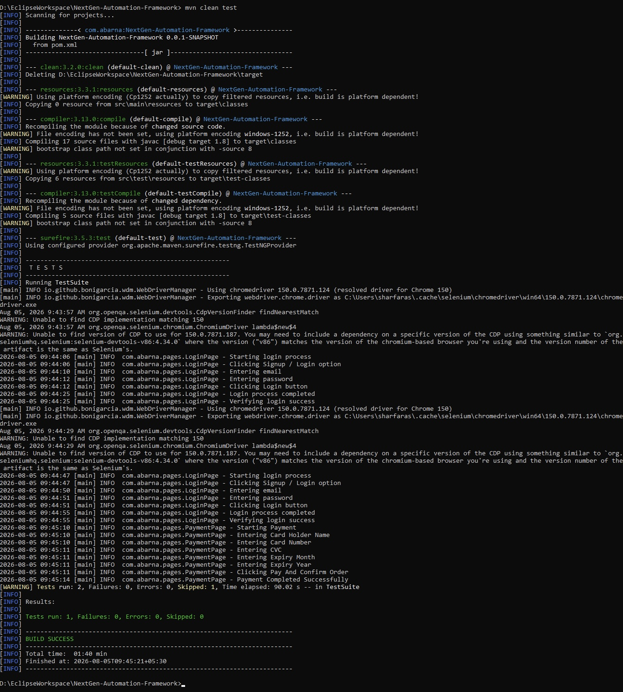
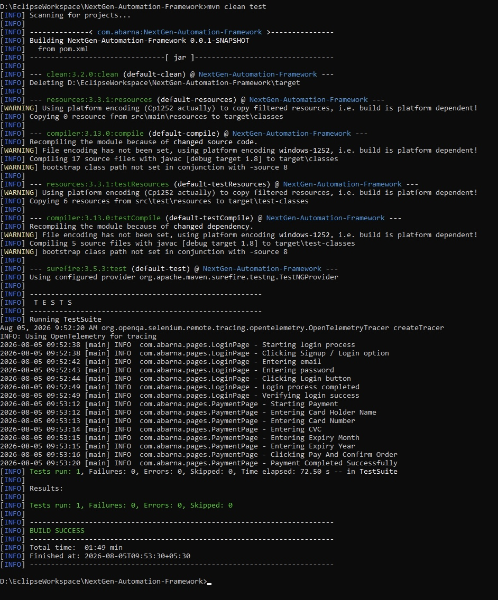
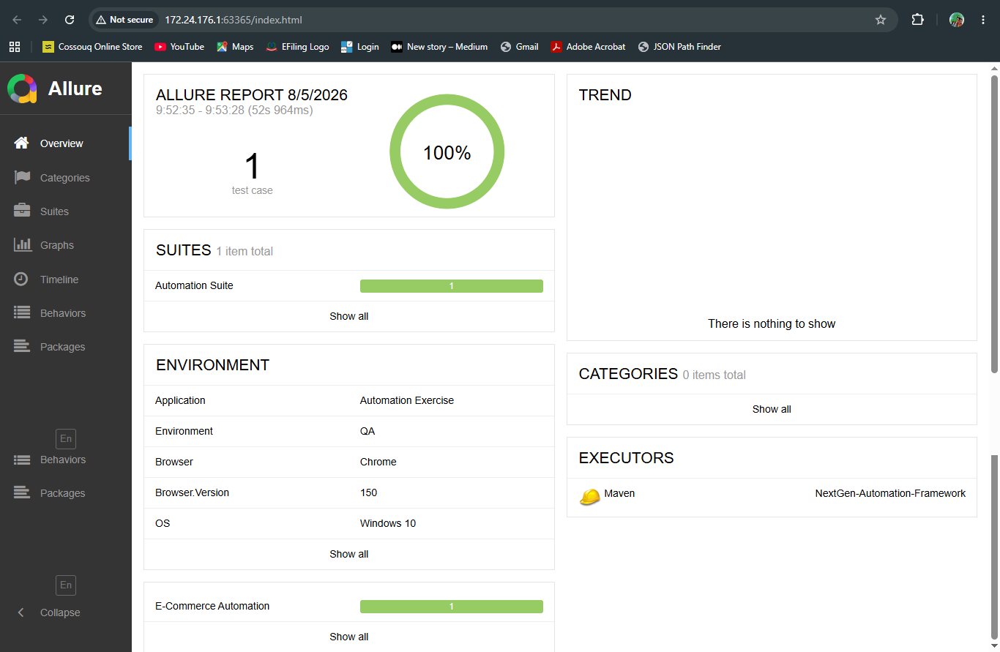
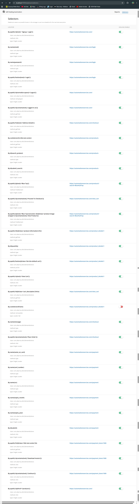

# NextGen Automation Framework

## Overview

NextGen Automation Framework is a scalable Selenium automation framework developed using Java, TestNG, Maven, and the Page Object Model (POM) design pattern.

The framework is built with industry-standard automation practices and includes reporting, self-healing capabilities, Docker-based Selenium Grid execution, retry mechanism, logging, and configurable execution modes.

The project is designed to be easily extendable and maintainable for real-world web automation testing.

---

## Tech Stack

| Category | Technology |
|----------|------------|
| Language | Java |
| Build Tool | Maven |
| Automation | Selenium WebDriver |
| Test Framework | TestNG |
| Design Pattern | Page Object Model (POM) |
| Logging | Log4j2 |
| Reporting | Allure Reports, Extent Reports |
| Self Healing | Healenium |
| Grid Execution | Selenium Grid |
| Containerization | Docker |
| Driver Management | WebDriverManager |
| Version Control | Git & GitHub |

---

# Project Structure

```
NextGen-Automation-Framework
│
├── src
│   ├── main
│   │     ├── config
│   │     ├── constants
│   │     ├── driver
│   │     ├── pages
│   │     └── utils
│   │
│   └── test
│         ├── resources
│         └── tests
│
├── docker
├── docs
├── logs
├── pom.xml
├── testng.xml
└── README.md
```

---

# Features

- Selenium WebDriver with Java
- TestNG Test Framework
- Maven Project Structure
- Page Object Model (POM)
- Configurable Browser & Execution
- Local Execution
- Remote Execution (Selenium Grid)
- Docker Support
- Healenium Self-Healing Locators
- Log4j2 Logging
- Allure Reporting
- Extent Reporting
- Retry Analyzer
- Screenshot Capture on Failure
- Config Reader Utility
- Driver Factory Pattern
- Explicit Wait Utilities
- Professional Project Structure

---

# Reporting

### Allure Reports

- Test execution history
- Steps
- Screenshots
- Pass / Fail status

### Extent Reports

- Test execution summary
- Detailed logs
- Screenshot support
- HTML report generation

---

# Selenium Grid

The framework supports both Local and Remote execution.

Execution mode can be changed through the configuration file.

```
execution=local
```

or

```
execution=remote
```

Remote execution uses Selenium Grid running inside Docker containers.

---

# Healenium Self-Healing

The framework integrates Healenium to automatically recover from locator changes.

Workflow:

1. Successful execution stores locator reference.
2. Locator changes in the application.
3. Selenium fails to locate the element.
4. Healenium compares the DOM.
5. Similar locator is identified.
6. Execution continues without modifying the test code.

---

# Retry Analyzer

Failed tests are automatically retried before being marked as failed.

Benefits:

- Reduces flaky test failures
- Handles temporary network or browser issues
- Improves execution stability

---

# Logging

Log4j2 is integrated to generate execution logs.

Example:

```
Starting Login Process

Entering Email

Clicking Login Button

Login Successful
```

---

# Running the Project

### Clone Repository

```bash
git clone https://github.com/AbarnaSelv/NextGen-Automation-Framework.git
```

---

### Install Dependencies

```bash
mvn clean install
```

---

### Execute Tests

```bash
mvn clean test
```

---

### Generate Allure Report

```bash
allure serve target/allure-results
```

---

# Docker

Start Selenium Grid

```bash
docker compose -f docker-compose-grid.yml up -d
```

Stop Selenium Grid

```bash
docker compose -f docker-compose-grid.yml down
```

---

# Screenshots

## Local Execution



---

## Remote Execution (Docker Selenium Grid)



---

## Allure Report



---

## Healenium Dashboard



---

# Future Enhancements

The following features are planned for future versions of the framework:

- Excel Data Provider
- JSON Data Provider
- Environment Switching (QA / UAT / Production)
- ThreadLocal WebDriver
- Browser Factory
- Cross Browser Execution
- Cross Platform Execution
- Jenkins CI/CD Integration
- GitHub Actions CI/CD
- Parallel Execution
- Docker Compose Optimization
- Data Driven Framework
- API Automation Integration
- Database Validation
- Performance Test Integration

---

# Author

**Abarna S**

GitHub

https://github.com/AbarnaSelv

---

# License

This project is created for learning, portfolio, and automation framework development purposes.